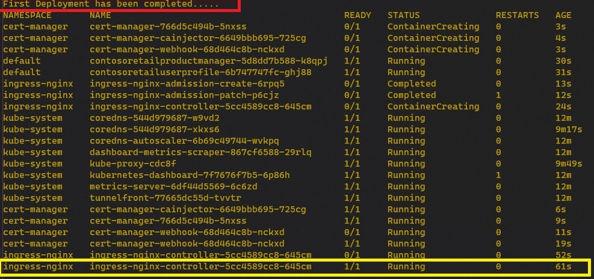

## Step 1 - Deploy Azure Resources /  Step 2 - Configure Kubernetes Ingress Controller and Cert Manager

### How to Start

1. Open [Deploy1.bat](Deploy1.bat) file and check the parameter lists
    
        Powershell.exe -executionpolicy remotesigned -File deployResources.ps1 
            --location "westus2" 
            --subscriptionID "{Your Azure SubscriptionID}" 
            --CertificateEamil "{Your Email Address}"
            --existingresourceGroupName "{The Resourcegroup name where Analytics resources deployed}" 
            --existingstorageAccountName "{The Storage account name which has been created in Analytics resource deployment step}" 
            --existingcosmosDBName "{The CosmosDB name which has been created in Analytics resource deployment step}"

2. Update Parameters by your preference and status. then save and open command console and execute [Deploy1.bat](Deploy1.bat) file.   ***Email Address should be valid one for your Certificate***

        (Your Path)\Synapse-Retail-Recommender\3. Application Backend Deployment>Deploy1.bat

1.  Deployment takes quite long. lean back and see the console and wait till shows this messages like below.  
   Once you see the ***"First Deployment has been completed...."***  message, the first Deployment job completed.    

    Wait for a while ingress-nginx-controller-* 's READY status from 0/1 to 1/1

1. Once nginx controller's READY status is 1/1, press CTRL+C and exit the batch process.  
Your batch file worked too much things behalf of you. below are the steps that deployResources.ps1 file did.

  #### Step 1 : Deploy Azure Resources
  -  Deploy Azure Container Registry Service 
  -  Deploy Azure Kubernetes Service
  -  Deploy Azure Storage Account
  -  Setting ServicePrinciple to work together with ACR and AKS
  

#### Step 2 : Configurure Kubernetes Ingress Controller and Cert Manager
  - Deploy API Services in Kubernetes
  - Deploy Nginix Ingress Controller in Kubernetes
  - Deploy cert-manager to preparing self-signed certificate to support SSL

##### [Back to Main Page](README.md)  | [Goto Next Step 3](Step3.md)