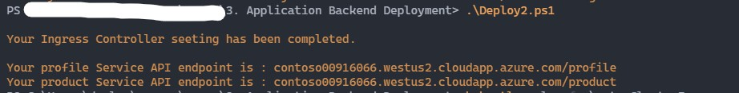
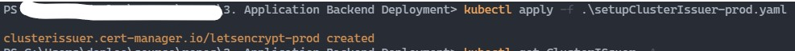
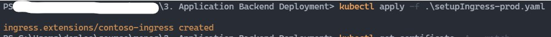
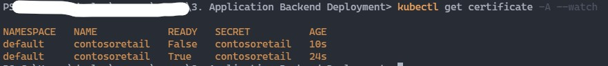
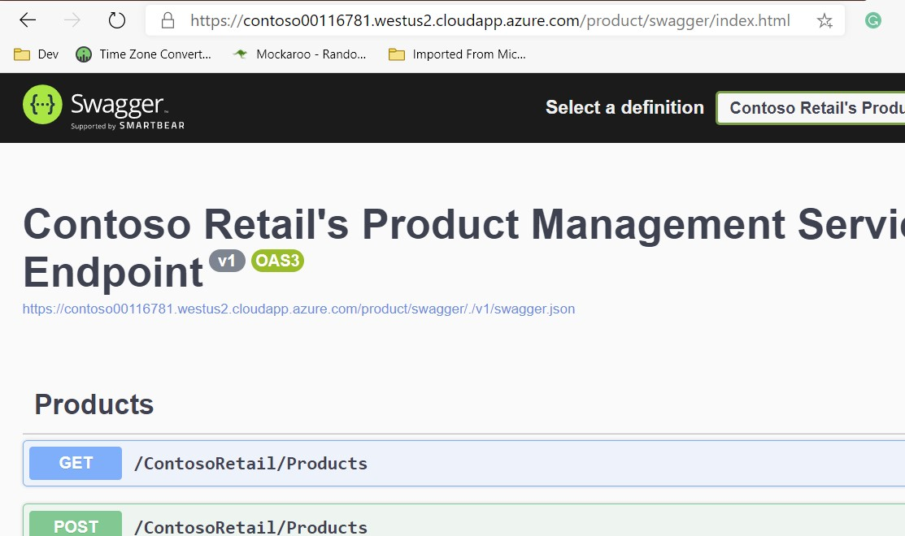

# Step 3 - Configure SSL

#### Your API services has been already deployed in Kubernetes but you can't access their service endpoint so far.  Becuase they don't expose any public network endpoint. so we are going to set up Network Ingress configuration and apply SSL encryption.

## 1. Config DNS Name for each Service Endpoints

Try to execute powershell script [Deploy2.ps1](Deploy2.ps1) in your powershell console window.   
(Deploy2.ps1 file will be generated based on Deploy2.ps1.template by Deploy1.ps1)  

        .\Deploy2.ps1
Just in case you've got error for the file is not degitally signed, try to execute Deploy2.ps1 file like below

        Powershell.exe -executionpolicy remotesigned -File .\Deploy2.ps1

About 30 seconds after, you can get Service Endpoints URLs like below

Now the Service Endpoints have URL. Not to conflict with other services URL, we created A record with random 8 digit number and "contoso"
  
The script created service endpoints per each services.  
the APIs shares same url subdomain contosoXXX but each requests will be routed to each services by Path.  
  

## 2. Set up Certificate Issuer

To issusing Certficiate to services, we need to set up Certificate Issuer like blow.

         .\kubectl apply -f .\setupClusterIssuer-prod.yaml

## 3. Set up Ingress Controller with Certificate

        .\kubectl apply -f .\setupIngress-prod.yaml

Wait for about 30 seconds till Certificate has been issued for the service endpoints.  
Type in your console like below and wait till certificate status changed to READY.  

        .\kubectl get certificate -A --watch

Congraturations! you have completed for API Service Deployment.  
You can check them from the URL what we created in Config DNS Name.

In your browser you can check the service endpoints (URL will be diffrent)

> <https://contoso00916066.westus2.cloudapp.azure.com/profile/swagger/index.html>
> <https://contoso00916066.westus2.cloudapp.azure.com/product/swagger/index.html>  
> <https://contoso00916066.westus2.cloudapp.azure.com/purchasehistory/swagger/index.html>
> <https://contoso00916066.westus2.cloudapp.azure.com/recommendationbyitem/swagger/index.html>  
> <https://contoso00916066.westus2.cloudapp.azure.com/recommendationbyUser/swagger/index.html>  
> 
**[Caution]** Though your swagger documents can be seen with these URL but your service endpoint shoud be different.

> Profile Service Endpoint => https://contoso00916066.westus2.cloudapp.azure.com/profile/**ContosoRetail**/Users  
> Product Service Endpoint => https://contoso00916066.westus2.cloudapp.azure.com/product/**ContosoRetail**/Products  
> PurchaseHistory Service Endpoint => https://contoso00916066.westus2.cloudapp.azure.com/purchasehistory**ContosoRetail**/PurchaseHistory    
> Recommendation by Item Service Endpoint => https://contoso00916066.westus2.cloudapp.azure.com/recommendationbyitem/**ContosoRetail**/GetRecommendationItems  
> Product Service Endpoint => https://contoso00916066.westus2.cloudapp.azure.com/recommendationbyUser/**ContosoRetail**/GetRecommendationUsers

***Copy your service Endpoint URLs and put this information in Web Application source code to invoke these services.***

So far we has completed deployment for Product / Profile API Services.
this is the works we had in this step.

#### Step 3: Configure Ingress Router
  - Set up DNS name to ingress router
  - Creating Certicifate Issuer with LetsEncrypt
  - Config Ingress Controller for Services to support SSL

The next step is setting up master data for product and profile.

#####  [To to Main Page](README.md)   |  [Back to Step 1,2](Step1,2.md)  | [Goto Next Step 4](Step4.md)